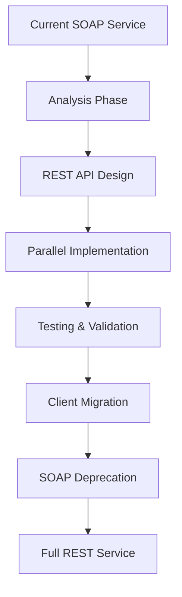

# SOAP vs REST Comparison Chart

## Technology Stack Comparison

| Aspect | Current SOAP | Proposed REST |
|--------|-------------|---------------|
| **Java Version** | 8 | 17 |
| **Spring Boot** | 2.7.18 | 3.2.0+ |
| **Protocol** | SOAP/HTTP | HTTP/JSON |
| **Data Format** | XML | JSON |
| **Schema Definition** | XSD | OpenAPI/JSON Schema |
| **Code Generation** | JAXB | Not required |
| **Framework** | Spring-WS | Spring Web |
| **Validation** | XML Schema | Bean Validation |
| **Documentation** | WSDL | Swagger/OpenAPI |

## Endpoint Comparison

| Operation | SOAP Endpoint | REST Endpoint | HTTP Method |
|-----------|--------------|---------------|-------------|
| Add Item | `AddItemRequest` | `/api/v1/cart/items` | POST |
| Get Cart | `GetCartRequest` | `/api/v1/cart` | GET |
| Remove Item | `RemoveItemRequest` | `/api/v1/cart/items/{id}` | DELETE |
| Update Quantity | `UpdateQuantityRequest` | `/api/v1/cart/items/{id}` | PUT |
| Clear Cart | `ClearCartRequest` | `/api/v1/cart` | DELETE |
| Checkout | `CheckoutRequest` | `/api/v1/cart/checkout` | POST |

## Request/Response Examples

### Add Item Operation

#### SOAP Request
```xml
<soap:Envelope xmlns:soap="http://schemas.xmlsoap.org/soap/envelope/">
  <soap:Body>
    <AddItemRequest xmlns="http://example.com/shoppingcart">
      <productId>PROD123</productId>
      <quantity>2</quantity>
    </AddItemRequest>
  </soap:Body>
</soap:Envelope>
```

#### REST Request
```http
POST /api/v1/cart/items
Content-Type: application/json

{
  "product_id": "PROD123",
  "quantity": 2
}
```

#### SOAP Response
```xml
<soap:Envelope xmlns:soap="http://schemas.xmlsoap.org/soap/envelope/">
  <soap:Body>
    <AddItemResponse xmlns="http://example.com/shoppingcart">
      <success>true</success>
    </AddItemResponse>
  </soap:Body>
</soap:Envelope>
```

#### REST Response
```http
HTTP/1.1 201 Created
Content-Type: application/json

{
  "success": true,
  "message": "Item added successfully"
}
```

### Get Cart Operation

#### SOAP Request
```xml
<soap:Envelope xmlns:soap="http://schemas.xmlsoap.org/soap/envelope/">
  <soap:Body>
    <GetCartRequest xmlns="http://example.com/shoppingcart"/>
  </soap:Body>
</soap:Envelope>
```

#### REST Request
```http
GET /api/v1/cart
Accept: application/json
```

#### SOAP Response
```xml
<soap:Envelope xmlns:soap="http://schemas.xmlsoap.org/soap/envelope/">
  <soap:Body>
    <GetCartResponse xmlns="http://example.com/shoppingcart">
      <cartItems>
        <productId>PROD123</productId>
        <quantity>2</quantity>
      </cartItems>
      <cartItems>
        <productId>PROD456</productId>
        <quantity>1</quantity>
      </cartItems>
    </GetCartResponse>
  </soap:Body>
</soap:Envelope>
```

#### REST Response
```http
HTTP/1.1 200 OK
Content-Type: application/json

{
  "items": [
    {
      "product_id": "PROD123",
      "quantity": 2
    },
    {
      "product_id": "PROD456",
      "quantity": 1
    }
  ],
  "total_items": 3
}
```

## Error Handling Comparison

### SOAP Error (Fault)
```xml
<soap:Envelope xmlns:soap="http://schemas.xmlsoap.org/soap/envelope/">
  <soap:Body>
    <soap:Fault>
      <faultcode>Client</faultcode>
      <faultstring>Invalid product ID</faultstring>
    </soap:Fault>
  </soap:Body>
</soap:Envelope>
```

### REST Error
```http
HTTP/1.1 400 Bad Request
Content-Type: application/json

{
  "timestamp": "2024-01-15T10:30:00Z",
  "status": 400,
  "error": "Bad Request",
  "message": "Product ID cannot be blank",
  "path": "/api/v1/cart/items",
  "validation_errors": [
    {
      "field": "product_id",
      "message": "Product ID cannot be blank"
    }
  ]
}
```

## Benefits Summary

| Benefit | SOAP | REST |
|---------|------|------|
| **Payload Size** | Large (XML overhead) | Small (JSON compact) |
| **Caching** | Not cacheable | HTTP caching support |
| **Human Readable** | Complex XML | Simple JSON |
| **Browser Support** | Limited | Native |
| **Mobile Friendly** | No | Yes |
| **Tooling** | Complex | Simple (curl, Postman) |
| **Learning Curve** | Steep | Gentle |
| **Industry Standard** | Legacy | Modern |

## Implementation Complexity

### SOAP Implementation
```java
@Endpoint
public class ShoppingCartEndpoint {
    @PayloadRoot(namespace = NAMESPACE_URI, localPart = "AddItemRequest")
    @ResponsePayload
    public AddItemResponse addItem(@RequestPayload AddItemRequest request) {
        // Complex XML mapping and namespace handling
    }
}
```

### REST Implementation
```java
@RestController
@RequestMapping("/api/v1/cart")
public class CartController {
    @PostMapping("/items")
    public ResponseEntity<OperationResponse> addItem(@Valid @RequestBody AddItemRequest request) {
        // Simple JSON mapping and HTTP semantics
    }
}
```

## Migration Path



## Key Migration Decisions

| Decision Point | SOAP Approach | REST Approach | Rationale |
|----------------|---------------|---------------|-----------|
| **Data Binding** | JAXB + XSD | Jackson + DTOs | Simpler, no code generation |
| **Validation** | XML Schema | Bean Validation | More flexible, better error messages |
| **Error Handling** | SOAP Faults | HTTP Status + JSON | Standard, descriptive |
| **Documentation** | WSDL | OpenAPI/Swagger | Interactive, developer-friendly |
| **Testing** | SOAP UI | REST Assured/Postman | Better tooling, easier automation |
| **Monitoring** | Custom | Actuator + Micrometer | Standard metrics, better observability |

This comparison clearly shows the advantages of migrating from SOAP to REST, both in terms of technical simplicity and modern development practices.